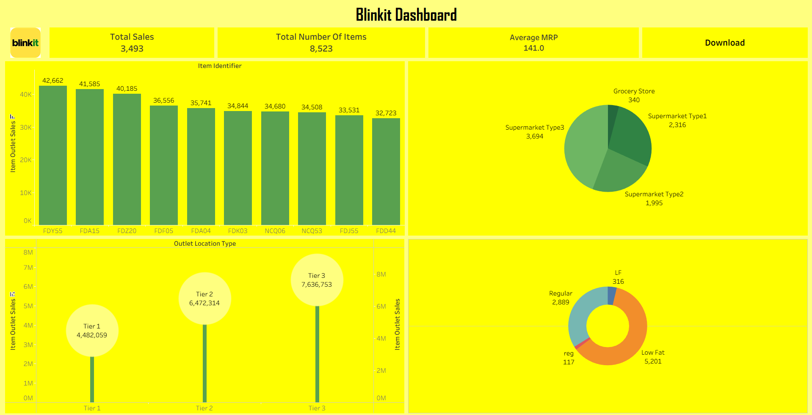
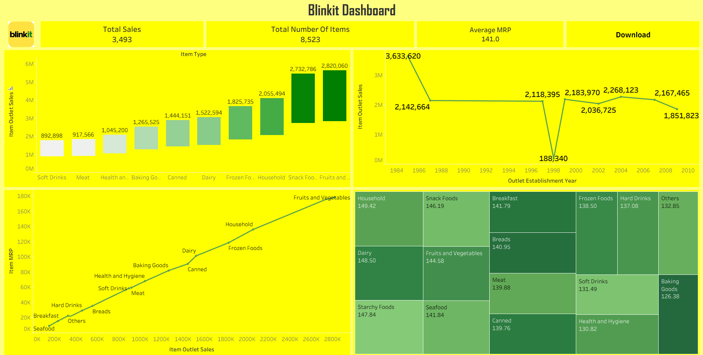
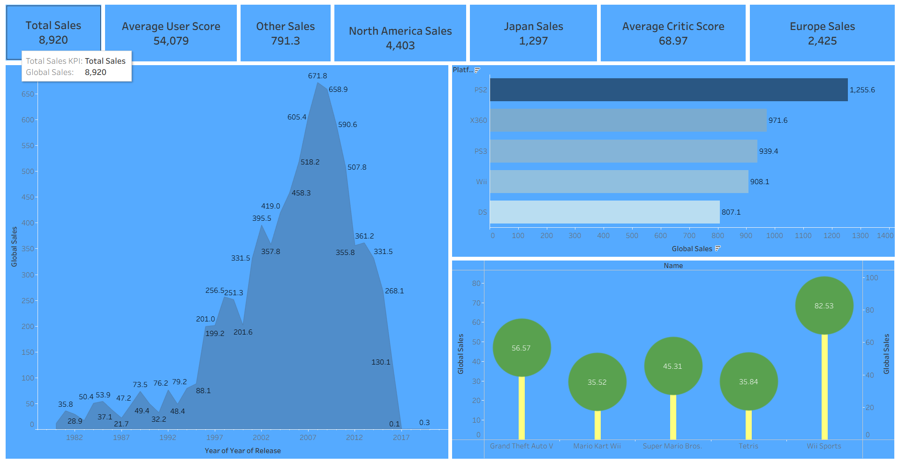
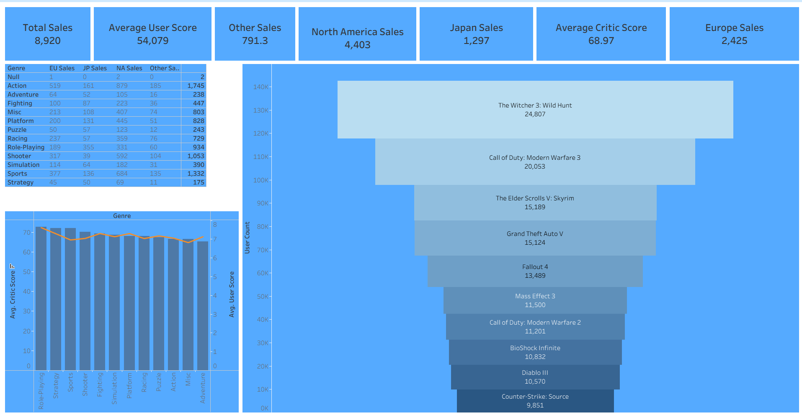
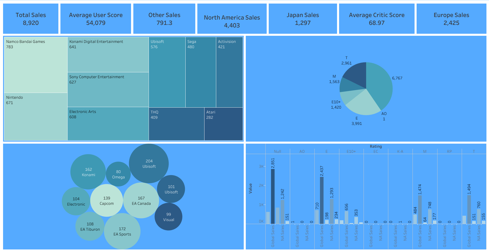
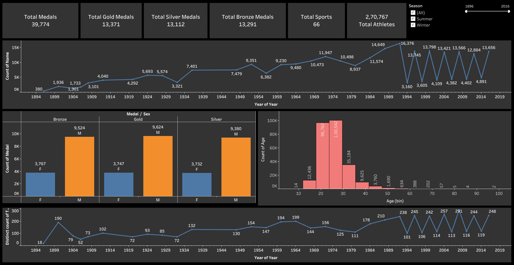
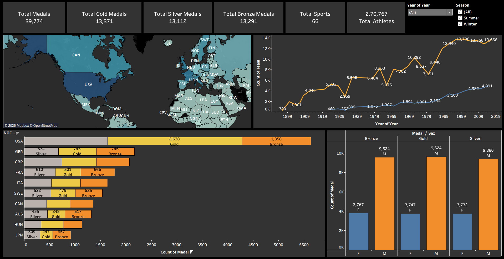
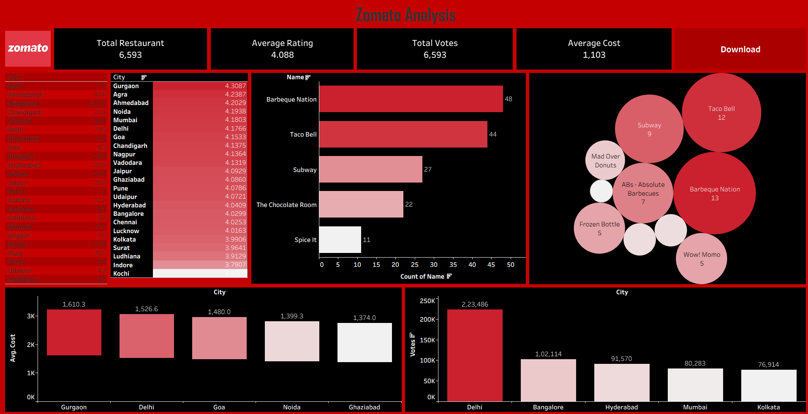

<p align="center">
  
</p>

<h1 align="center">Tableau Dashboard Portfolio</h1>

<p align="center">
  <strong>A collection of interactive Tableau dashboards spanning retail analytics, gaming intelligence, sports history, and food industry insights — built to demonstrate real-world business storytelling through data.</strong>
</p>

<p align="center">
  <a href="#blinkit-dashboard">Blinkit</a>
  |
  <a href="#epic-games-dashboard">Epic Games</a>
  |
  <a href="#olympics-dashboard">Olympics</a>
  |
  <a href="#zomato-dashboard">Zomato</a>
</p>

<p align="center">
  
  
  
</p>

<p align="center">
  
  
  
  
</p>

---

<table>
  <tr>
    <td width="55%">
      <h2>Turn Raw Data Into Business Stories.</h2>
      <p>
        This repository is a curated portfolio of four Tableau dashboards, each built on a real-world dataset
        from a different industry. Every dashboard is designed with a clear KPI header, interactive filters,
        and multiple chart types to answer distinct business questions at a glance.
      </p>
      <p>
        From quick-commerce grocery sales to global Olympic medal history, each project demonstrates
        data cleaning, visual design, and analytical thinking — skills directly applicable to
        Data Analyst and BI roles.
      </p>
    </td>
    <td width="45%">
      <table>
        <tr><td><strong>Blinkit</strong></td><td>Grocery sales, outlet & MRP analysis</td></tr>
        <tr><td><strong>Epic Games</strong></td><td>Video game global sales & publisher data</td></tr>
        <tr><td><strong>Olympics</strong></td><td>120 years of medals, athletes & nations</td></tr>
        <tr><td><strong>Zomato</strong></td><td>Restaurant ratings & city-level food trends</td></tr>
      </table>
    </td>
  </tr>
</table>

---

## Dashboard Overview

<table>
  <tr>
    <td align="center" width="25%">
      <h3>🟡 Blinkit</h3>
      <p>Sales performance across item types, outlet tiers, and store formats — with MRP and fat content breakdowns.</p>
    </td>
    <td align="center" width="25%">
      <h3>🔵 Epic Games</h3>
      <p>Global video game sales across platforms, genres, publishers, and regions with critic and user score analysis.</p>
    </td>
    <td align="center" width="25%">
      <h3>⚫ Olympics</h3>
      <p>120 years of Olympic history — medal counts, country maps, athlete age distributions, and gender trends.</p>
    </td>
    <td align="center" width="25%">
      <h3>🔴 Zomato</h3>
      <p>Restaurant landscape across Indian cities — ratings, average cost, top chains, and engagement by votes.</p>
    </td>
  </tr>
</table>

---

## Blinkit Dashboard

> **Quick Commerce Sales Intelligence** — Analysing 8,500+ grocery items across outlet types, location tiers, and product categories.

### Key KPIs

| Metric | Value |
| --- | --- |
| Total Sales | 3,493 |
| Total Number of Items | 8,523 |
| Average MRP | Rs. 141.0 |

### Dashboard Views

**Dashboard 1 — Outlet & Location Analysis**



Charts included:
- Bar chart — Top 10 items by outlet sales (Item Identifier)
- Bubble chart — Sales by Outlet Location Type (Tier 1, 2, 3)
- Pie chart — Sales split by outlet type (Grocery Store, Supermarket Types 1/2/3)
- Donut chart — Fat content distribution (Low Fat, Regular, LF, reg)

**Dashboard 2 — Category & Trend Analysis**



Charts included:
- Bar chart — Sales by Item Type (Fruits & Vegetables, Snack Foods, Household, etc.)
- Line chart — Sales trend by Outlet Establishment Year (1984–2010)
- Scatter plot — Item MRP vs Item Outlet Sales by category
- Treemap — Average MRP per product category (Household → Seafood)

### Key Insights

```text
Best Location Tier  : Tier 3 — Rs. 7,636,753 in sales
Top Item Type       : Fruits and Vegetables + Snack Foods
Highest Avg MRP     : Household items (Rs. 149.42)
Most Common Fat Type: Low Fat — 5,201 items
Best Outlet Type    : Supermarket Type 3 — 3,694 items
```

---

## Epic Games Dashboard

> **Video Game Global Sales Analysis** — Exploring 8,920 total game sales across platforms, genres, publishers, and regions from 1980 to 2020.

### Key KPIs

| Metric | Value |
| --- | --- |
| Total Sales | 8,920 |
| North America Sales | 4,403 |
| Europe Sales | 2,425 |
| Japan Sales | 1,297 |
| Other Sales | 791.3 |
| Average Critic Score | 68.97 |
| Average User Score | 54,079 |

### Dashboard Views

**Dashboard 1 — Sales Trends & Platforms**



Charts included:
- Area chart — Global sales by Year of Release (1980–2020)
- Horizontal bar chart — Top 5 platforms by global sales (PS2, X360, PS3, Wii, DS)
- Lollipop chart — Top 5 best-selling games (Wii Sports, GTA V, Mario Kart Wii, etc.)

**Dashboard 2 — Genre & User Review Analysis**



Charts included:
- Data table — Sales by Genre across EU, JP, NA, and Other regions
- Combo chart — Average Critic Score and Average User Score by Genre
- Funnel chart — Top 10 games by User Count (The Witcher 3, Call of Duty series, Skyrim)

**Dashboard 3 — Publisher & Rating Analysis**



Charts included:
- Treemap — Top publishers by game count (Namco Bandai, Nintendo, EA, Konami, Ubisoft)
- Bubble chart — Top developers by title count
- Pie chart — Game distribution by ESRB Rating (E, T, M, E10+)
- Bar chart — Global and NA sales breakdown by Rating category

### Key Insights

```text
Best Platform       : PS2 — 1,255.6M global sales
Top Genre           : Action — 1,745 total sales
Top Publisher       : Namco Bandai Games — 783 titles
Peak Year           : 2008–2009 (671.8M + 658.9M global sales)
Most Reviewed Game  : The Witcher 3: Wild Hunt — 24,807 user reviews
Best-Selling Game   : Wii Sports — 82.53M global sales
```

---

## Olympics Dashboard

> **120 Years of Olympic History** — Visualising medals, athletes, nations, and gender trends from Athens 1896 to Rio 2016.

### Key KPIs

| Metric | Value |
| --- | --- |
| Total Medals | 39,774 |
| Total Gold Medals | 13,371 |
| Total Silver Medals | 13,112 |
| Total Bronze Medals | 13,291 |
| Total Sports | 66 |
| Total Athletes | 2,70,767 |

### Dashboard Views

**Dashboard 1 — Athlete & Medal Trends**



Charts included:
- Line chart — Athlete participation count by Year (1894–2019, Summer + Winter toggle)
- Grouped bar chart — Medal count by Gender (Bronze, Gold, Silver) — Male vs Female
- Histogram — Athlete age distribution (peak age: 20–30)
- Line chart — Distinct team count trend over time

**Dashboard 2 — Country & Geographic Analysis**



Charts included:
- Choropleth world map — Medal counts shaded by country (USA dominating)
- Line chart — Team participation growth by Year
- Horizontal stacked bar — Top 10 NOC countries by medal type (Gold, Silver, Bronze)
- Grouped bar chart — Medal count by Gender across medal types
- Season filter — Separate Summer and Winter Olympic toggles

### Key Insights

```text
Most Decorated Nation : USA — 2,638 Gold + 1,358 Bronze
Peak Athlete Count    : 16,376 athletes (1990s)
Most Common Age Range : 20–25 years (96,762 + 1,00,642 athletes)
Gender Gap            : Male athletes ~2.5x more medals than Female
Total Sports Covered  : 66 disciplines across 120+ years
```

---

## Zomato Dashboard

> **India's Restaurant Landscape** — Analysing 6,593 restaurants across 20+ Indian cities for ratings, cost, cuisine preference, and engagement.

### Key KPIs

| Metric | Value |
| --- | --- |
| Total Restaurants | 6,593 |
| Average Rating | 4.088 |
| Total Votes | 6,593 |
| Average Cost for Two | Rs. 1,103 |

### Dashboard View



Charts included:
- Highlighted table — Average rating by city (Gurgaon tops at 4.31)
- Horizontal bar chart — Top 5 restaurant chains by outlet count (Barbeque Nation — 48)
- Bubble chart — Top restaurant brands by presence (Taco Bell, Subway, Barbeque Nation)
- Bar chart — Average cost by city (Gurgaon Rs. 1,610 → Ghaziabad Rs. 1,374)
- Bar chart — Total votes by city (Delhi leads with 2,23,486 votes)

### Key Insights

```text
Highest Rated City  : Gurgaon — 4.31 avg rating
Most Votes City     : Delhi — 2,23,486 votes
Most Expensive City : Gurgaon — Rs. 1,610 avg cost for two
Top Restaurant Chain: Barbeque Nation — 48 outlets
Most Outlets Brand  : Taco Bell — 12 (bubble chart)
```

---

## Repository Structure

```text
Tableau-Dashboards/
  |
  |-- Blinkit-Dashboard/
  |     |-- Dashboard-1.png          <- Outlet & Location view
  |     |-- Dashboard-2.png          <- Category & Trend view
  |     +-- Blinkit_Dashboard.twbx   <- Tableau packaged workbook
  |
  |-- Epic-Games-Dashboard/
  |     |-- Dashboard-1.png          <- Sales Trends & Platforms view
  |     |-- Dashboard-2.png          <- Genre & Review view
  |     |-- Dashboard-3.png          <- Publisher & Rating view
  |     +-- EpicGames_Dashboard.twbx
  |
  |-- Olympics-Dashboard/
  |     |-- Dashboard-1.png          <- Athlete & Medal Trends view
  |     |-- Dashboard-2.png          <- Country & Geographic view
  |     +-- Olympics_Dashboard.twbx
  |
  +-- Zomato-Dashboard/
        |-- Dashboard.png            <- Full Zomato analysis view
        +-- Zomato_Dashboard.twbx
```

---

## Chart Types Used

| Chart Type | Used In |
| --- | --- |
| Bar Chart | Blinkit, Epic Games, Zomato, Olympics |
| Line Chart | Blinkit, Olympics |
| Pie / Donut Chart | Blinkit, Epic Games |
| Treemap | Blinkit, Epic Games |
| Bubble / Lollipop Chart | Blinkit, Epic Games, Zomato |
| Area Chart | Epic Games |
| Scatter Plot | Blinkit |
| Funnel Chart | Epic Games |
| Choropleth Map | Olympics |
| Histogram | Olympics |
| Highlighted Table | Zomato, Epic Games |

---

## Tech Stack

<table>
  <tr>
    <td><strong>Visualization</strong></td>
    <td>Tableau Desktop / Tableau Public</td>
  </tr>
  <tr>
    <td><strong>Data Sources</strong></td>
    <td>CSV / Excel datasets (Blinkit, Kaggle Video Games, Olympic History, Zomato)</td>
  </tr>
  <tr>
    <td><strong>Data Prep</strong></td>
    <td>Tableau Data Interpreter, Calculated Fields, LOD Expressions</td>
  </tr>
  <tr>
    <td><strong>Interactivity</strong></td>
    <td>Dashboard Actions, Filters, Parameter Controls, Highlight Actions</td>
  </tr>
  <tr>
    <td><strong>Design</strong></td>
    <td>Custom color themes per brand (Yellow/Green, Blue, Dark, Red/Black)</td>
  </tr>
</table>

---

## Skills Demonstrated

- Building multi-sheet dashboards with KPI header panels
- Designing brand-matched color themes (Blinkit yellow, Zomato red, etc.)
- Using calculated fields and LOD expressions for aggregated metrics
- Creating interactive filters (Season toggle, Year slider, City selector)
- Combining 10+ chart types in a single cohesive dashboard layout
- Translating raw CSV data into business-ready visual stories

---

## Author

**Jay Darji**
B.E. Information Technology — Apollo Institute of Engineering and Technology, GTU

- GitHub: [jaydarji2101](https://github.com/jaydarji2101)
- LinkedIn: [linkedin.com/in/jay-darjii](https://linkedin.com/in/jay-darjii)
- Email: darjijay2101@gmail.com

---

<p align="center">
  <strong>Each dashboard in this portfolio is a complete business intelligence story — from raw data to insight to decision.</strong>
</p>

<p align="center">
  Built as part of a Data Analytics portfolio to demonstrate Tableau proficiency across multiple domains.
</p>
